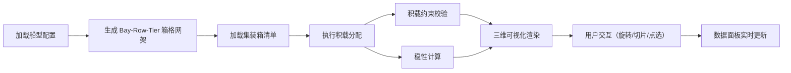

## 1. 产品概述

集装箱船积载三维可视化工具是一款面向航运物流领域的专业应用，通过三维可视化技术直观展示集装箱在船上的堆放情况，并提供积载约束校验和稳性计算功能。

- 核心价值：将复杂的船舶积载规则和稳性计算以直观的三维方式呈现，帮助配载人员快速校验积载方案的合理性与安全性
- 目标用户：船舶配载员、港口调度人员、航运物流专业学生

## 2. 核心功能

### 2.1 用户角色

| 角色 | 注册方式 | 核心权限 |
|------|----------|----------|
| 普通用户 | 无需注册 | 查看船型、导入箱单、进行积载校验和稳性计算 |

### 2.2 功能模块

1. **三维船型可视化模块**：Bay-Row-Tier 箱格网架、OrbitControls 交互、贝位切片查看
2. **集装箱积载模块**：箱单数据管理、箱子三维渲染、属性着色、点选详情
3. **积载约束校验模块**：重不压轻、卸货港顺序（翻箱）、冷藏箱电源、危险品隔离、尺寸适配
4. **稳性计算模块**：重心计算、横倾/纵倾计算、GM 稳性指标、配平预警
5. **数据面板模块**：全船箱量统计、总重量、各港口箱量、稳性指标展示

### 2.3 页面详情

| 页面名称 | 模块名称 | 功能描述 |
|----------|----------|----------|
| 主界面 | 顶部工具栏 | 船型选择、箱单导入、视图切换、贝位切片控制 |
| 主界面 | 三维视口 | Three.js 船架与箱子渲染、OrbitControls 旋转缩放、点选交互 |
| 主界面 | 左侧面板 | 箱单列表、筛选与搜索、按港口高亮 |
| 主界面 | 右侧面板 | 稳性数据面板、约束校验结果、各港口箱量统计 |
| 主界面 | 底部状态栏 | 当前选中箱位信息、预警提示 |

## 3. 核心流程

用户进入应用后，系统加载默认船型配置和模拟箱单数据，自动进行积载并执行约束校验与稳性计算。用户可通过三维视口旋转查看船舶，通过贝位切片查看横截面，点击箱子查看详情。系统实时计算并展示稳性指标，违规积载以红色高亮显示。

## 4. 用户界面设计

### 4.1 设计风格
- **设计方向**：工业科技风 / 深色仪表盘风格
- **主色调**：深蓝灰背景（#0a1628），配合青色（#00d4ff）和橙色（#ff6b35）点缀
- **辅助色**：红色（#ff4757）用于违规警示，绿色（#2ed573）用于正常状态
- **字体**：使用 JetBrains Mono 等宽字体展示数据，搭配现代无衬线字体
- **布局**：三栏式仪表盘布局，中央为三维视口，两侧为数据面板
- **视觉元素**：网格线、科技感边框、数据发光效果、半透明面板

### 4.2 页面设计概述

| 页面名称 | 模块名称 | UI 元素 |
|----------|----------|---------|
| 主界面 | 三维视口 | 深色背景、网格地面、线框船架、彩色集装箱、发光高亮效果 |
| 主界面 | 数据面板 | 半透明深色卡片、数据网格、进度条、状态指示灯 |
| 主界面 | 工具栏 | 图标按钮、下拉选择器、滑块控件、悬停动效 |
| 主界面 | 箱单列表 | 滚动列表、行高亮、分类标签、颜色指示器 |

### 4.3 响应式
- 桌面端优先设计，三栏布局
- 中等屏幕可折叠侧面板
- 移动端自适应堆叠布局

### 4.4 3D 场景指导
- **环境**：深色空间背景，配合微弱雾效增强深度感
- **光照**：环境光 + 方向光 + 点光源，突出集装箱金属质感
- **相机**：PerspectiveCamera，初始俯视角 45 度
- **交互**：OrbitControls 支持旋转、缩放、平移；自动限制旋转角度
- **动画**：箱子选中有发光脉冲效果；贝位切片有过渡动画；违规箱子红色闪烁提示
- **性能**：使用 InstancedMesh 优化大量集装箱渲染；按需更新几何体
