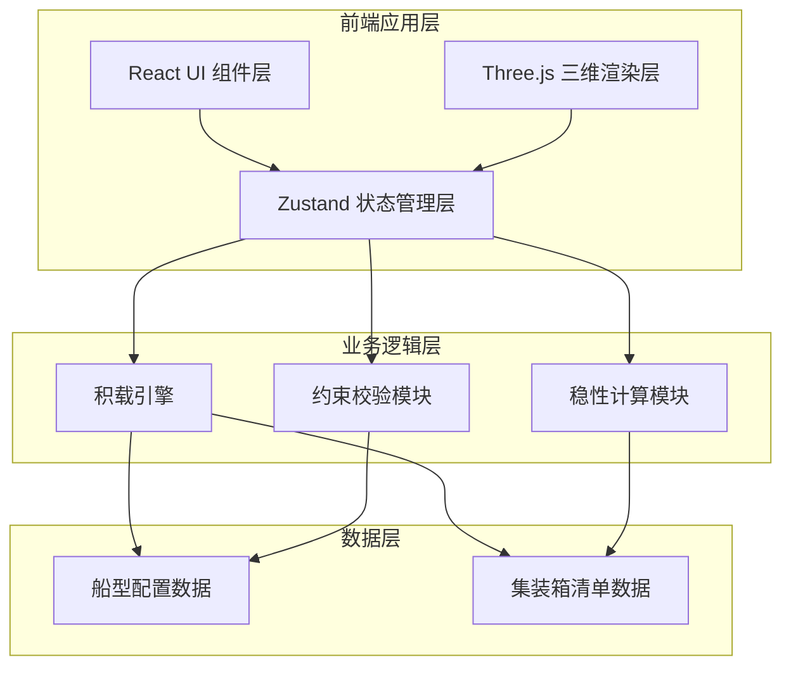
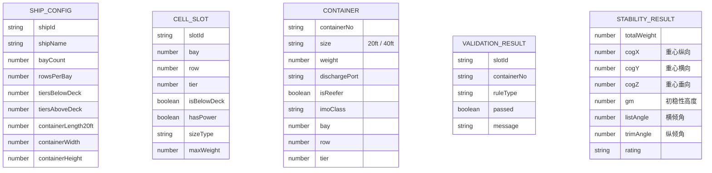

## 1. 架构设计

## 2. 技术描述

- **前端框架**：React 18 + TypeScript
- **构建工具**：Vite 5
- **样式方案**：TailwindCSS 3
- **状态管理**：Zustand
- **三维引擎**：Three.js
- **图标库**：Lucide React
- **后端**：无（纯前端应用，数据内置）
- **数据**：内置模拟船型配置和集装箱清单数据

## 3. 模块划分

### 3.1 核心数据模块

| 模块 | 文件 | 职责 |
|------|------|------|
| 船型配置 | `src/data/shipConfig.ts` | 定义船型参数、Bay-Row-Tier 结构、电源位置等 |
| 箱单数据 | `src/data/containers.ts` | 模拟集装箱清单数据 |
| 类型定义 | `src/types/index.ts` | 所有 TypeScript 类型定义 |

### 3.2 业务逻辑模块

| 模块 | 文件 | 职责 |
|------|------|------|
| 积载引擎 | `src/stowage/stowageEngine.ts` | 箱子分配到箱位的核心逻辑 |
| 约束校验 | `src/stowage/validation.ts` | 重不压轻、翻箱、隔离、尺寸等校验 |
| 稳性计算 | `src/stability/calculator.ts` | 重心、横倾、纵倾、GM 计算 |

### 3.3 三维渲染模块

| 模块 | 文件 | 职责 |
|------|------|------|
| 三维场景 | `src/components/three/Scene.tsx` | Three.js 场景、相机、灯光、控制 |
| 船架渲染 | `src/components/three/ShipRack.tsx` | Bay-Row-Tier 箱格网架渲染 |
| 集装箱渲染 | `src/components/three/Containers.tsx` | 集装箱三维渲染与交互 |
| 贝位切片 | `src/components/three/BaySlice.tsx` | 贝位横截面切片查看 |

### 3.4 UI 组件模块

| 模块 | 文件 | 职责 |
|------|------|------|
| 顶部工具栏 | `src/components/ui/Toolbar.tsx` | 视图控制、切片控制、船型选择 |
| 左侧箱单面板 | `src/components/ui/ContainerList.tsx` | 箱单列表、筛选、港口高亮 |
| 右侧数据面板 | `src/components/ui/DataPanel.tsx` | 稳性数据、校验结果、港口统计 |
| 箱子详情弹窗 | `src/components/ui/ContainerDetail.tsx` | 点击箱子显示详情 |

### 3.5 状态管理

| 模块 | 文件 | 职责 |
|------|------|------|
| 全局状态 | `src/store/useStore.ts` | 船型、箱单、选中、视图等全局状态 |

## 4. 数据模型

### 4.1 Bay-Row-Tier 坐标系

### 4.2 核心类型定义

- **ShipConfig**：船型配置，包含贝数、排数、层数、尺寸参数
- **CellSlot**：箱位单元，Bay-Row-Tier 坐标，属性（甲板上下、有无电源、可放尺寸）
- **Container**：集装箱，箱号、尺寸、重量、卸货港、冷藏/危险品属性、积载位置
- **ValidationIssue**：约束违规项，违规类型、位置、描述
- **StabilityData**：稳性计算结果，重心坐标、GM、横倾纵倾、评级

## 5. 核心算法说明

### 5.1 Bay-Row-Tier 坐标系统
- **Bay（贝位）**：沿船长方向（X轴），从船首到船尾编号
- **Row（排）**：沿船宽方向（Y轴），从左舷到右舷编号
- **Tier（层）**：沿船高方向（Z轴），从下到上编号
- 甲板下箱位（Below Deck）：货舱内
- 甲板上箱位（Above Deck）：甲板以上

### 5.2 积载约束校验
1. **重不压轻**：比较同一列（同 Bay+Row）上下层箱子重量
2. **翻箱检查**：比较同一列上下层箱子的卸货港顺序
3. **冷藏箱电源**：冷藏箱必须放在 hasPower=true 的箱位
4. **危险品隔离**：危险品箱与普通箱、不同等级危险品间的间距检查
5. **尺寸适配**：40尺箱不能放在仅支持20尺的箱位

### 5.3 稳性计算
- **重心 (CoG)**：按各箱重量加权平均计算三维坐标
- **横倾 (List)**：横向重心偏离中线引起的倾斜
- **纵倾 (Trim)**：纵向重心偏离浮心引起的倾斜
- **GM 值**：初稳性高度 = 浮心高度 - 重心高度 + 定倾半径（简化计算）
- **稳性评级**：根据 GM 值和倾斜角度评估安全等级

## 6. 性能优化策略

- 使用 InstancedMesh 批量渲染集装箱
- 按需更新几何体，避免全量重绘
- 约束校验采用增量计算
- 大列表采用虚拟滚动
